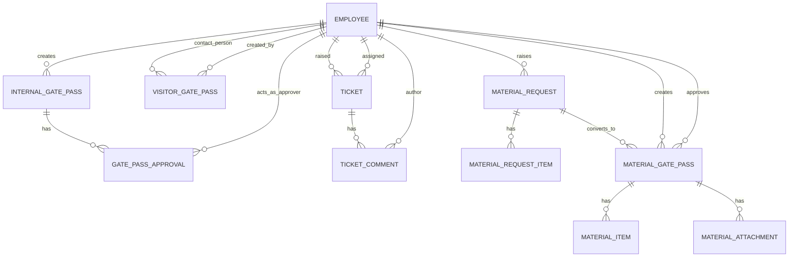

# ERP System Guide (Gate Pass System)

This document explains how to use the ERP system, how each module works, what the approval workflows are, and how the database data is fetched and linked (hierarchy/relationships).

Project type: Django (MySQL)  
Main apps: `accounts`, `dashboard`, `internal_pass` (IGP), `visitor_pass` (VGP), `material_pass` (MGP/MR), `helpdesk` (HD)

## 1) System Overview

### 1.1 Login and Session Rules
- Login URL: `/accounts/login/`
- Default post-login landing: `/` (Dashboard)
- Session timeout and single-login enforcement are handled by middleware:
  - Maintenance mode gatekeeping
  - Session inactivity timeout
  - Single-login: if a user logs in from another device/session, the earlier session can be kicked

### 1.2 Roles and Departments (Hierarchy)
The system has:
- Departments (e.g., Store, IT, Security, HR & Admin, Mechanical, etc.)
- Roles (e.g., employee, department_hod, hr, security, management, president_plant_head, administrator)
- Reporting hierarchy (Reporting Person): `Employee.reporting_person` defines the organizational tree.

Important: an employee can now have:
- One Primary Department + Additional Departments
- One Primary Role + Additional Roles

This is used to determine:
- Module access (permissions)
- Approval visibility
- Which users are considered eligible approvers/recipients in workflows

### 1.3 Permissions (Module Rights)
Permissions are stored on the `Employee` record (granular Boolean flags), for example:
- `perm_igp_view`, `perm_igp_write`, `perm_igp_approve`, ...
- `perm_vgp_view`, ...
- `perm_mgp_view`, ...
- `perm_helpdesk_manage`, ...

These permissions control whether a user can view/create/approve/delete/export inside each module.

## 2) Navigation Map (Routes)

Main route groups:
- Dashboard: `/` and `/dashboard/`
- Accounts: `/accounts/`
- Internal Gate Pass (IGP): `/internal-pass/`
- Visitor Gate Pass (VGP): `/visitor-pass/`
- Help Desk (HD): `/helpdesk/`
- Material Gate Pass (MGP) + Material Request (MR): `/material-pass/`

## 3) Modules and Workflows

### 3.1 Dashboard (Home)
Purpose:
- Quick counts and recent activity for IGP, VGP, HD, MGP
- Charts (last ~6 months) for IGP/VGP/MGP volume and statuses

Data fetching pattern:
- Uses ORM aggregations (`Count`, `TruncMonth`) and quick list slices with `select_related(...)` for recent rows.

### 3.2 Accounts (Users, Permissions, Settings)

#### 3.2.1 Employee Management
Screens:
- Employee list: filter/search
- Create/Edit employee
- Enable/Disable accounts
- Import/Export employees (Excel)

Key fields:
- `employee_code` (unique)
- `username` (unique, used for login)
- `email` (duplicate allowed)
- Primary and Additional Departments
- Primary and Additional Roles
- Reporting Person
- Module permissions matrix

Passwords:
- New users default to OTP password (example: `123456`) and must change after first login.

#### 3.2.2 System Settings
Contains:
- Series prefixes and next numbers for IGP/VGP/MGP/MR/TKT
- SMTP and email settings
- Maintenance mode
- Workflow notification channels (popup/email) per module
- Workflow configuration (workflows/stages/recipients)

Security note:
- Do not hardcode or commit real SMTP credentials in production. Prefer environment variables or secure secrets storage.

### 3.3 Internal Gate Pass (IGP)

#### 3.3.1 What It Is
IGP tracks internal movement / outing approvals for employees:
- Purpose, destination, out date/time, expected return, transport mode, etc.

#### 3.3.2 Workflow (Approval Stages)
IGP uses a role-based multi-stage workflow. Stages depend on the creator’s role.

Workflow is stored as `GatePassApproval` rows (one row per stage):
- Each stage has:
  - `stage_label`
  - `approver_role`
  - `status` (pending/approved/rejected)
  - unique action `token` for email approval link

Approval logic:
- The next pending stage is emailed (Approve/Reject).
- Once all stages are approved, the pass becomes `approved`.
- If rejected at any stage, pass becomes `rejected`.

#### 3.3.3 Return Flow
Return flow is captured via `actual_return_time` and status can move to `returned` when applicable.

#### 3.3.4 Printing and Reports
IGP includes:
- Print layout for pass
- Reports and exports (where enabled by permissions)

### 3.4 Visitor Gate Pass (VGP)

#### 3.4.1 What It Is
VGP tracks visitor entry requests:
- Visitor details (name, mobile, ID type/number, company, city)
- Visit details (date/time, purpose, details)
- Contact person (employee) to meet/approve
- Optional photo capture and checkout

#### 3.4.2 Workflow
Typical VGP flow:
1. Requester creates VGP
2. Contact person receives approval request
3. Contact person approves or rejects
4. If approved, visitor can enter and later be checked out (status `checked_out`)

#### 3.4.3 Photo and Checkout
- Photo can be captured or uploaded.
- Checkout captures actual out time and updates status.

### 3.5 IT Help Desk (HD)

#### 3.5.1 What It Is
Help Desk manages tickets:
- DocType, title, category, priority, description
- Raised by employee, assigned to IT, comments, resolution note

#### 3.5.2 Assignment and Visibility
- IT users (or users mapped to IT department via additional departments) can manage tickets.
- Non-IT users see tickets in their own department(s).

#### 3.5.3 Ticket Lifecycle
Statuses:
- open -> in_progress -> resolved/closed

Notifications:
- When resolved/closed, requester is notified (according to notification channel settings).

### 3.6 Material Gate Pass (MGP) and Material Request (MR)

This app has two connected flows:
- Direct MGP creation (creates a gate pass immediately)
- MR -> Store review -> Convert to MGP (recommended for store-controlled issuance)

#### 3.6.1 Material Request (MR) Workflow
Entities:
- `MaterialRequest` + `MaterialRequestItem`

Typical MR flow:
1. Employee creates MR with items and required-by date
2. Department HOD stage (status changes to `hod_approved` or `hod_rejected`) where applicable
3. Store HOD stage (status changes to `store_approved` or `store_rejected`)
4. Only after `store_approved`, Store converts MR into an MGP
5. MR status becomes `converted` after gate pass creation

#### 3.6.2 Convert MR -> MGP
On convert:
- MGP is pre-filled from MR:
  - department, returnable flag, reason/remarks, expected return/required-by date, items list
- Store fills remaining details:
  - consignor (sender) details
  - consignee (party) details
  - transport, tax, bank, etc.

#### 3.6.3 MGP Approval
MGP approval is designed for Store HOD approval only (store workflow).
- Approver is resolved from Store department users (Store HOD / MGP approver users).

#### 3.6.4 Printing (Document Copies)
MGP print is generated as 3 pages by default:
- Original for Buyer
- Duplicate for Transporter
- Triplicate for Supplier

Each printed page contains a clear “Document Copy” reference label.

## 4) Notifications and Email Workflow

The system supports:
- Popup notifications (in-app)
- Email notifications (SMTP)

Workflow notifications are controlled by System Settings:
- per-module toggles: popup/email enablement
- configurable workflows and stages:
  - who gets notified
  - what channel (popup/email/both/none)
  - whether requester (creator) also receives updates

Important behavior:
- Email is primarily intended for approval forwarding or workflow-defined recipients.
- Logging: sent/failed/skipped emails are stored in the Email Log (if enabled).

## 5) Database: Models, Relationships, and Hierarchy

### 5.1 Database Engine
- MySQL (configured in Django `DATABASES`)
- Django ORM is the primary data-access layer

### 5.2 Core “Master” Tables

#### Employee (`accounts.Employee`)
Acts as the central identity table for:
- pass creators/requesters
- approvers
- workflow recipients
- ticket raisers/assignees

Key relationships:
- IGP: `InternalGatePass.employee -> Employee`
- VGP: `VisitorGatePass.person_to_meet -> Employee`, `created_by -> Employee`
- MGP: `MaterialGatePass.employee -> Employee`, `approver -> Employee`
- MR: `MaterialRequest.employee -> Employee`, `reviewed_by -> Employee`, `hod_by -> Employee`
- HD: `Ticket.raised_by -> Employee`, `Ticket.assigned_to -> Employee`

Multi department/role storage:
- Primary: `department`, `role`
- Additional: `additional_departments`, `additional_roles` (stored as a serialized list)

### 5.3 Module Relationships (Mermaid ER)

### 5.4 How Data Is “Fetched” From DB (ORM Patterns)

Common patterns used throughout modules:
- List pages:
  - Filter by role/department/permission
  - Filter by status and search query
  - Paginate with Django `Paginator`
- Detail pages:
  - `get_object_or_404(Model, pk=...)`
  - show related objects via `related_name` relations
- Performance:
  - `select_related()` when loading foreign keys (e.g., `employee`, `person_to_meet`)
  - `prefetch_related()` when loading child collections (items, approvals) if needed
- Aggregations for dashboard/reports:
  - `annotate()`, `values()`, `Count()`, `Sum()`, `TruncMonth()`

Example concepts (not exact code):
- Fetch recent passes with employee details:
  - `InternalGatePass.objects.select_related('employee').order_by('-created_at')[:5]`
- Filter data for users with multiple departments:
  - filter where `employee.department IN user.departments`
  - or `employee.additional_departments contains |dept|`

### 5.5 Status Fields (How Workflow State Is Stored)

Status fields are simple strings on the main record, for example:
- IGP: `InternalGatePass.status` (`pending`, `in_progress`, `approved`, `rejected`, `returned`)
- VGP: `VisitorGatePass.status` (`pending`, `approved`, `rejected`, `checked_out`)
- MGP: `MaterialGatePass.status` (`pending`, `approved`, `rejected`, `returned`)
- MR: `MaterialRequest.status` (`submitted`, `hod_approved`, `store_approved`, `converted`, etc.)
- HD: `Ticket.status` (`open`, `in_progress`, `resolved`, `closed`)

For multi-step workflows (IGP), stage state is also stored in a child table:
- `GatePassApproval` (1 row per stage)

## 6) Operational Notes (Admin / Deployment)

### 6.1 DB Initialization
- Run migrations for all apps: `python manage.py migrate`
- Create admin/superuser: `python manage.py createsuperuser` (if enabled)

### 6.2 Media and Static
- Uploaded files/images are in `media/`
- Static assets are in `static/`

### 6.3 Email
- SMTP settings exist in Django settings.
- Production should store secrets securely and restrict outbound email.

## 7) Quick “How To” (Common Tasks)

### 7.1 Create Internal Gate Pass (IGP)
1. Open IGP module
2. Fill purpose, destination, timings
3. Submit for approval
4. Approvers act via email links or approval page (depending on role)
5. Print after approval (if required)

### 7.2 Create Visitor Gate Pass (VGP)
1. Open VGP module
2. Fill visitor + visit details
3. Submit for approval to Contact Person
4. Capture photo
5. Checkout visitor after exit

### 7.3 Create Material Request -> Convert to MGP
1. Employee creates MR and items
2. HOD approval (if configured)
3. Store HOD approval
4. Store converts MR to MGP and fills remaining details
5. Store HOD approves MGP
6. Print (3 copies)

### 7.4 Raise IT Help Desk Ticket
1. Open Help Desk
2. Create ticket with correct category/priority
3. IT assigns and resolves
4. Requester gets updates based on notification settings

## 8) Glossary
- IGP: Internal Gate Pass
- VGP: Visitor Gate Pass
- MGP: Material Gate Pass
- MR: Material Request (used to create MGP)
- HD: Help Desk (Ticketing)

